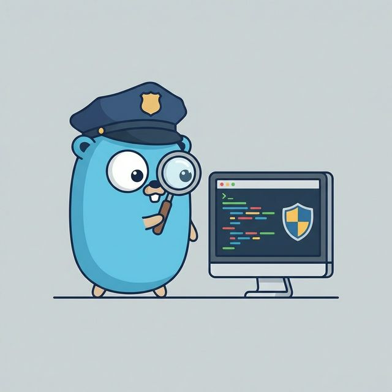

# 🕵️‍♂️ Phase 8: Govulncheck - The Bug Safari

Welcome to the jungle! 🌴 Occasionally, some sneaky bugs (vulnerabilities) try to hide in the code your project depends on. These aren't just any bugs—they're the security-threatening kind! 

In this adventure, we’re going to use `govulncheck` to sniff them out, evaluate the danger, and send them packing!

## 🎯 The Mission Plan

1.  **[The Vulnerability Trap](./01-vuln-tutorial/README.md)**: We’ll set up a project with a "known-to-be-naughty" version of a package and see if our Gopher-scanner can find it.
2.  **[The Great Upgrade](./02-upgrade-vulnerable-dependencies/README.md)**: We’ll learn how to patch things up and verify that the coast is clear.

---

## 🛠️ The Safari Gear

- **[govulncheck](https://pkg.go.dev/golang.org/x/vuln/cmd/govulncheck)**: Your loyal tracker dog for vulnerabilities.
- **Go Vulnerability Database**: The "Most Wanted" list of Go bugs.

---

> [!TIP]
> `govulncheck` is super smart—it only barks if the vulnerability is *actually* reachable by your code. No false alarms here! 🐹🚫🐛
