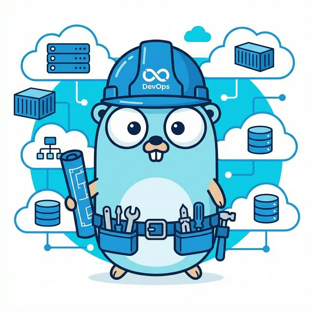

# 🐹 Go Learning Project: The Gopher Hole

Welcome to the ultimate Go Learning Project! This isn't just a bunch of code; it's a gourmet journey through the world of Go, guided by our very own **DevOps Platform Engineer Gopher**. 



Whether you're a "baby gopher" just starting out or a seasoned "gopher architect" building the next big thing, we've got you covered. From making your first "Hello World" (without breaking the computer) to hunting down security bugs like a pro!

## 🗺️ Learning Roadmap: Choose Your Adventure

Don't just walk—hop through our structured roadmap! Each tutorial follows the official Go standards, but with more flavor.

| Adventure | What's the deal? |
| :--- | :--- |
| 1. **[Getting Started](./01-getting-started/README.md)** | "Hello World" is just the beginning. 🌍 |
| 2. **[Create a Go Module](./02-create-a-go-module/README.md)** | Learn to organize your laundry... I mean, your code. 📦 |
| 3. **[Workspace Wizardry](./03-multi-module-workspaces/README.md)** | Handle multiple modules like a circus juggler. 🤹 |
| 4. **[Relational Database Fun](./04-accessing-a-relational-database/README.md)** | Chatting with MySQL without getting Ghosted. 🐳 |
| 5. **[RESTful APIs with Gin](./05-restful-api-with-go-and-gin/README.md)** | Fast APIs for people who don't like waiting for coffee. ☕ |
| 6. **[Go Generics](./06-getting-started-with-generics/README.md)** | One function to rule them all (types, that is). 💍 |
| 7. **[Fuzzing for Fun & Profit](./07-getting-started-with-fuzzing/README.md)** | Letting random data throw a tantrum at your code to find bugs. 💥 |
| 8. **[Govulncheck: The Bug Safari](./08-find-and-fix-vulnerable-dependencies-with-govulncheck/README.md)** | Hunting down security vulnerabilities before they get us! 🕵️‍♂️ |

---


## 🛠️ Get the Gear

Before you start hopping around, you need the tools. If you're on a Mac, just brew it:

```bash
brew install go
```

### Is it alive?
Check if your Gopher is ready to go:
```bash
go version
```

---

## 🤔 Why Go, though?

- **Simplicity**: Because nobody has time for 1,000-page manuals.
- **Concurrency**: Like having 100 Gophers doing your chores at once.
- **Performance**: Faster than a Gopher smelling a fresh carrot.
- **Tooling**: Built-in everything. Formatting, testing, scanning. It's like a Swiss Army Gopher!

Happy Coding, Gopher-hero! 🐹🚀